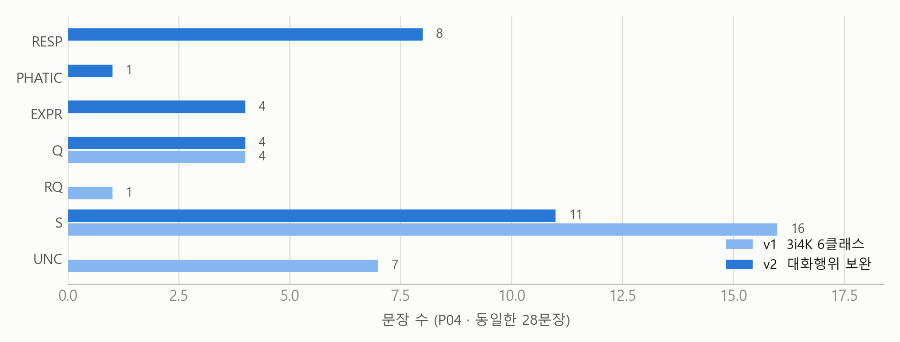
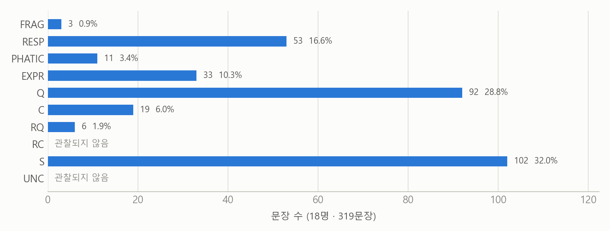
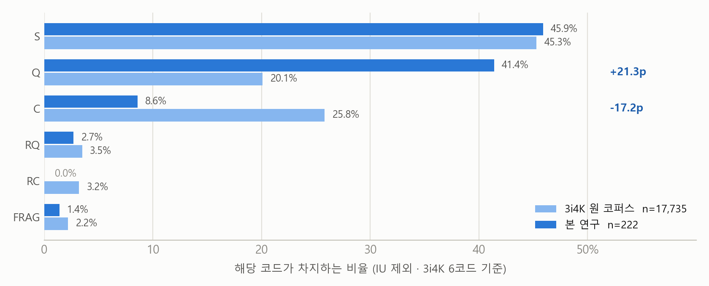
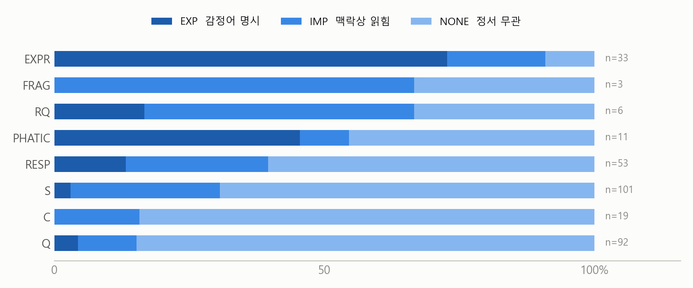
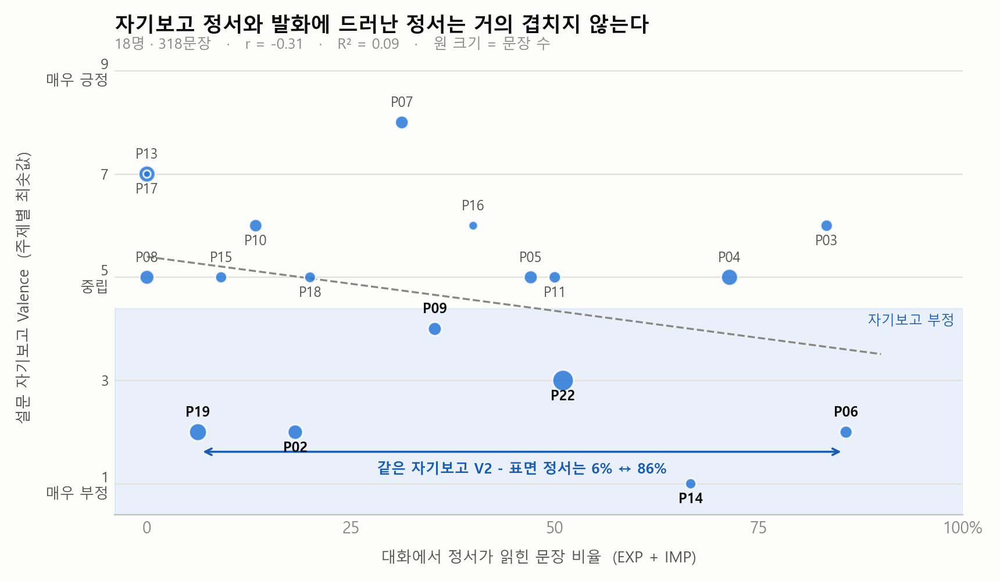
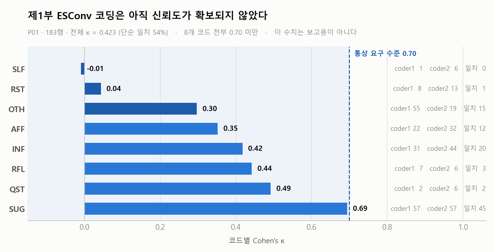

# 사람들은 GPT와 어떻게 대화하는가 — 파일럿 연구

> 실사용자가 자기 ChatGPT 대화 로그를 제출하고, 같은 대화에 대해 감정을 자기보고한
> 자료를 분석했다. **사용자 발화의 화행(speech act)과 정서 표면성을 두 축으로 라벨링하는
> 체계를 제안하고, 그 체계로 자기보고와 로그가 얼마나 어긋나는지 확인한다.**

참가자 **22명** · 대화 **22건** · 메시지 **598개**(사용자 299 / AI 299) · 에피소드 **28개**
자료 수집 2026-07-22 ~ 2026-08-04

이 문서는 **파일럿 결과 보고서**다. 본 실험의 결과가 아니라, 본 실험을 설계하기 위해
먼저 돌려 본 것이다. 여기서 나온 수치는 효과 크기 추정과 코딩 체계 검증에 쓰고,
가설 검정 근거로는 쓰지 않는다.

---

## 목차

1. [참가자](#1-참가자)
2. [사람들은 GPT와 무슨 이야기를 하는가](#2-사람들은-gpt와-무슨-이야기를-하는가)
3. [어떤 감정 상태로 GPT를 쓰는가](#3-어떤-감정-상태로-gpt를-쓰는가)
4. [라벨링 체계 제안 — 3i4K + 감정 표면성](#4-라벨링-체계-제안--3i4k--감정-표면성)
5. [발견](#5-발견)
6. [연구 설계의 한계](#6-연구-설계의-한계)
7. [다음 연구자를 위한 메모](#7-다음-연구자를-위한-메모)
8. [자료 구성 · 재현 · 개인정보](#8-자료-구성--재현--개인정보)

---

## 1. 참가자

편의표본이다. 연구자 주변의 대학생·대학원생을 모집했다.

| 구분 | 값 |
|---|---|
| 인원 | **22명** |
| 성별 | **여 16명 (72.7%) · 남 6명 (27.3%)** |
| 나이 | 평균 **23.7세** · 중앙값 24 · 범위 **20–27** |
| 요금제 | 무료 17 · 유료 5 |
| 사용 모델 | GPT-5.5 계열 19 · 그 외 3 |
| 사용 빈도 | 거의 매일 10 · 주 3–5회 5 · 주 1–2회 2 · 월 1–3회 2 · 거의 안 씀 2 · 혼합응답 1 |

### 성별 × 연령대

| 연령대 | 여 | 남 | 계 |
|---|---|---|---|
| 20–22세 | 3 | 3 | 6 |
| 23–25세 | **13** | 1 | 14 |
| 26–27세 | 0 | 2 | 2 |
| **계** | **16** | **6** | **22** |

여성 평균 23.8세(21–25) · 남성 평균 23.7세(20–27). 평균은 같지만 **분포 모양이 다르다.**
여성은 23–25세에 13명이 몰려 있고, 남성은 6명이 20–27세에 흩어져 있다.
**성별과 연령이 교락(confound)되어 있어 어느 쪽 효과도 분리할 수 없다.**
성별·연령을 변수로 쓰는 분석은 이 표본에서 하지 않았다.

---

## 2. 사람들은 GPT와 무슨 이야기를 하는가

두 가지를 따로 물었다. **평소에 무엇을 하는가**(습관)와 **이번에 실제로 무엇을
했는가**(관찰). 둘이 일치하지 않는다는 것이 이 절의 결론이다.

### 2-1. 평소 대화 주제 (복수응답, n=22)

| 주제 | 응답자 | 비율 |
|---|---|---|
| 정보 검색·질문 | 18 | **81.8%** |
| 학업·업무 도움 | 17 | **77.3%** |
| 글쓰기 도움 | 10 | 45.5% |
| 고민 상담 | 7 | 31.8% |
| 코딩·기술 | 6 | 27.3% |
| 일상 잡담 | 5 | 22.7% |
| 창작·놀이 | 2 | 9.1% |

한 사람이 평균 **3.0개**를 골랐다. 자유기술로 11종이 더 나왔는데
(논문 해석·번역, 자격증 문제 풀이, 자기소개서, 맛집·기계 사용법, 아이디어 얻기 등)
**전부 '정보 검색' 또는 '학업·업무'의 하위 항목이다.** 보기 밖의 새로운 용도는 없었다.

> **도구적 용도가 압도적이다.** 상위 2개(정보 검색 82%, 학업·업무 77%)가 나머지를
> 두 배 이상 앞선다. '고민 상담'은 32%로 4위다.

### 2-2. 이번에 실제로 한 대화 (에피소드 28개)

주제명은 참가자가 직접 적었고, 분류는 연구자가 주제명만 보고 사후에 묶었다.

| 분류 | 에피소드 | 비율 |
|---|---|---|
| 일상·잡담 | 13 | **46.4%** |
| 고민·정서 | 10 | **35.7%** |
| 학업·업무 | 4 | 14.3% |
| 정보 검색 | 1 | 3.6% |

실제 주제 예시 — 뱃살 걱정 · 퇴사 · 대인관계 · 대학원 컨택 · 야근 고민 ·
점심 뭐 먹을지 · 애견 동반 카페 검색 · 기준금리 · 자소서 · 민달팽이 · 공문 초안.

### 2-3. 두 표가 어긋난다

|  | 평소(자기보고) | 이번(실제) |
|---|---|---|
| 정보 검색 | 81.8% | **3.6%** |
| 학업·업무 | 77.3% | 14.3% |
| 고민·정서 상담 | 31.8% | **35.7%** |
| 일상·잡담 | 22.7% | **46.4%** |

**자기보고가 부정 정서(주제 Valence ≤ 3)였던 참가자 6명 중 5명이 평소 주제로
'고민 상담'을 고르지 않았다.** 평소엔 정보 검색용이라고 답한 사람이, 실제로는
퇴사·진로·대인관계를 이야기하며 부정 정서를 보고했다.

| 참가자 | 주제1 V | 실제 주제 | 평소 주제에 '고민 상담' |
|---|---|---|---|
| P14 | 1 | 퇴사 | — |
| P02 | 2 | 미래 연구 분야 결정 및 대학원 컨택 | — |
| P06 | 2 | 금요일 강릉 방문 예정과 야근 문제 고민 | — |
| P19 | 2 | 2학기 복학 전 스케줄 및 공부 계획 | — |
| P01 | 3 | 뱃살 걱정 | — |
| P22 | 3 | 대인관계 | ○ |

> ⚠️ 이 어긋남은 **관찰 조건 때문일 수도 있다.** "자유롭게 대화해 달라"고 했으므로
> 평소에 하던 일이 아니라 '연구에 낼 만한 대화'를 새로 만들었을 가능성을 배제할 수 없다.
> 다만 어느 쪽이든 **평소 용도 설문만으로는 실제 대화를 예측할 수 없다**는 결론은 같다.
> `n=6`이라 사례 수준이다.

---

## 3. 어떤 감정 상태로 GPT를 쓰는가

### 3-1. 평소 사용 시 감정 상태 (복수응답, n=22)

| 감정 상태 | 응답자 | 비율 |
|---|---|---|
| 답답함·스트레스 해소 목적 | 10 | **45.5%** |
| 호기심 | 10 | **45.5%** |
| 특별한 감정 없음 | 8 | 36.4% |
| 차분함 | 6 | 27.3% |
| 외로움·심심함 | 4 | 18.2% |
| 불안·걱정이 있을 때 | 4 | 18.2% |
| 즐거움·재미 | 4 | 18.2% |

**'답답함·스트레스 해소'가 '호기심'과 동률 1위다.** 평소 주제로는 '고민 상담'을
32%만 골랐는데, 감정 상태로는 **부정 정서 관련 항목(답답함 46% + 외로움 18% +
불안 18%)이 훨씬 넓게 분포한다.**

> **주제를 묻는 문항과 감정을 묻는 문항이 다른 그림을 준다.** 사람들은 자기 사용을
> '정보 검색'이라고 범주화하면서, 그 정보 검색을 **답답할 때** 한다.
> 정서적 사용을 별도의 용도로 인식하지 않는다.

### 3-2. 대화 전후 자기보고 VA (SAM 9점 척도)

| 문항 | n | 평균 | SD | 범위 |
|---|---|---|---|---|
| 전 Valence | 22 | 5.36 | 1.47 | 2–9 |
| 전 Arousal | 22 | 4.45 | 1.68 | 2–8 |
| 주제1 Valence | 22 | 5.23 | 2.25 | **1–9** |
| 주제1 Arousal | 22 | 5.36 | 1.68 | 2–8 |
| 후 Valence | 22 | 5.95 | 1.96 | 2–9 |
| 후 Arousal | 19 | 5.42 | 1.61 | 2–9 |

| 항목 | 값 |
|---|---|
| 대화 전후 Valence 변화 | **+0.59점** (5.36 → 5.95) · t=+1.89, **p=0.073 (유의하지 않음)** |
| 전 V ↔ 후 V 상관 | r=**0.668**, p=0.001 |
| 전 V ↔ 주제1 V 상관 | r=**0.292**, p=0.187 |

읽는 법 세 가지.

1. **대화 후 기분이 올라가는 경향은 있으나 유의하지 않다.** n=22에서 이 효과 크기로는
   검정력이 부족하다. 방향만 참고한다.
2. **전 V와 후 V는 강하게 상관한다(r=0.67).** 이것은 "대화가 기분을 바꿨다"가 아니라
   **참가자 간 순위가 유지된다**는 뜻이다. 변화량의 근거가 아니다.
3. **전 V와 주제 V는 거의 무관하다(r=0.29, p=0.19).** 대화 직전 기분과, 그 주제를
   이야기할 때의 기분은 **다른 것을 재고 있다.** 주제별 정서를 전반적 기분으로
   대체할 수 없다.

주제1 Valence의 범위가 1–9로 가장 넓다(SD 2.25). **개인의 전반 기분보다 주제가
정서를 훨씬 크게 가른다.**

---

## 4. 라벨링 체계 제안 — 3i4K + 감정 표면성

이 파일럿의 주된 산출물이다. 기준 문서는 [코딩북 제4부](codebook_part4_speechact.md).

### 4-1. 문제 — 기존 화행 체계가 상담형 대화를 못 덮는다

한국어 화행 분류의 표준인 **3i4K**(Cho et al., 2018)를 그대로 적용해 봤다.
`P04` 28문장 1인 파일럿 결과:

| 관찰 | 수치 |
|---|---|
| 실제로 사용된 코드 | 7개 중 **4개** (`FRAG`·`C`·`RC` 0건) |
| `S`(서술) 편중 | 16/28 = **57%** |
| `UNC`(분류 불가) | 7/28 = **25%** |

**`UNC` 7건이 무작위가 아니라 세 종류로 뭉쳤다.**

| 뭉친 종류 | 발화 예 |
|---|---|
| 친교 | "안녕 지피티야" |
| 감정 표출 | "오늘 출근하기 싫다", "아니 지랄 ㄴ" |
| 직전 발화에 대한 응답 | "됐다 안할래", "부드럽게", "엉" |

같은 현상이 코더 한 사람 안에서도 다르게 처리됐다
(`오늘 출근하기 싫다` → `UNC` / `아 너무 덥다` → `S`).
**체계가 데이터를 못 덮으니 코더가 같은 것을 다르게 처리한 것이다.**

> **왜 이런 구멍이 생기는가.** 3i4K는 **스마트 스피커 명령 발화**를 대상으로,
> 억양으로만 갈리는 문장을 걸러내려고 만들어졌다. 고립된 문장 하나를 다루므로
> **'직전 발화에 대한 응답'이라는 범주가 구조적으로 없고**, 담화 성분
> (Common Ground / Question Set / To-Do List) 확장 체계라 **'표출'도 '친교'도 없다.**
> 상담형 다중턴 대화에 그대로 쓸 수 없다.

### 4-2. 제안 — 두 축으로 나눈다

**축 A. 화행 — 9클래스 + UNC.** 3i4K에서 6개를 가져오고 세 계보에서 3개를 보충한다.

| 코드 | 기준 | 출처 |
|---|---|---|
| `FRAG` | 절이 완결되지 않음 (길이 무관) | 3i4K |
| `S` | 정보·상태 서술 | 3i4K |
| `Q` | 실제로 답을 요구 | 3i4K |
| `C` | 행동·수행을 요구 | 3i4K |
| `RQ` | 의문문 형식, 답 요구 없음 | 3i4K |
| `RC` | 명령문 형식, 실제 지시 아님 | 3i4K |
| **`RESP`** | **직전 AI 발화에 대한 대답·수락·거절** | DAMSL / Stolcke et al. |
| **`PHATIC`** | **인사·작별·감사·사과** | ISO 24617-2 (SOM) |
| **`EXPR`** | **감정·평가의 분출이 목적** | Searle (1976) |
| `UNC` | 어디에도 안 맞음 — **진단 지표** | 본 연구 |

> 3i4K의 `IU`(억양 의존)는 뺐다. **텍스트 전용 자료라 억양 판별이 불가능하다.**
> `EXPR`은 DAMSL·ISO 어느 쪽에도 독립 범주로 없어 Searle에서 가져왔다.
> **계보가 셋이라는 사실 자체를 논문에 밝혀야 한다.**

**축 B. 감정 표면성 — 3클래스.** 본 연구에서 새로 정의했다.

| 코드 | 기준 | 예 |
|---|---|---|
| `EXP` | 감정어·감정 표현이 **표면에 명시** | "너무 힘들어" |
| `IMP` | 표면에 감정어는 없으나 **맥락상 정서가 읽힘** | "그냥 뭐 괜찮아요" |
| `NONE` | 정서와 무관 | "기준금리가 뭐야" |

**두 축을 나눈 이유가 이 연구의 핵심 주장이다.** 화행은 "무엇을 하려는 발화인가"이고
표면성은 "정서가 얼마나 드러났는가"다. 한 축으로 합치면 *정보를 요청하면서 정서가
배어 있는 발화*를 표현할 방법이 없다. [4-5](#4-5-두-축이-서로-환원되지-않는다)에서
두 축이 실제로 독립임을 확인한다.

### 4-3. 판정 우선순위와 규칙

같은 발화가 여러 코드에 걸린다. **위에서부터 먼저 걸리는 것을 따른다.**

```
FRAG → RESP → PHATIC → EXPR → Q → C → RQ → RC → S → UNC
```

> **`RESP`가 `EXPR`보다 앞선다.** "아니 지랄 ㄴ"처럼 응답이면서 표출인 발화는
> `RESP`로 간다. **정서는 축 B가 이미 잡기 때문이다**(그 발화는 `EXP`).
> 축 A까지 정서를 기준으로 두면 두 축이 같은 것을 재게 되어 나눈 의미가 사라진다.

실제 코딩에서 반복해 갈린 경계 6개를 규칙으로 고정했다. 전문은
[코딩북 제4부](codebook_part4_speechact.md)에 있고, 다른 한국어 채팅 자료에도
그대로 걸릴 만한 것만 옮긴다.

| 규칙 | 내용 |
|---|---|
| **1. `S`/`EXPR`은 서술어로 가른다** | 서술어가 감정·평가면 `EXPR`, 사실·상황이면 `S`. 욕구형(`~싶다`·`~좋겠다`)은 `EXPR`. 단 `~싶다`가 추측이면 `S` |
| **2. `Q`/`C`는 무엇으로 충족되는지로 가른다** | 답변으로 충족되면 `Q`("추천해줘"도 `Q`), 행위 수행이 필요하면 `C`("길게 답장하지 마"). **한국어 채팅은 정보 요청을 명령형으로 하는 일이 매우 잦다** |
| **3. `RQ`·`RC`는 형식 요건이 있다** | `RQ`는 의문문, `RC`는 명령문일 때만. 평서문은 기능이 아무리 가까워도 해당 없음 |
| **4. `PHATIC`은 인사가 목적일 때만** | 문두에 붙은 인사는 무시하고 주 기능으로 판정. "안녕 퇴사하고 싶어" → `EXPR` |
| **5. `RESP`는 "AI가 요구한 것에 응할 때"로 한정** | 넓게 잡으면 턴의 첫 문장이 거의 다 `RESP`가 되어 `EXPR`·`Q`가 사라진다. AI 발화 뒤에 나왔어도 **새 화제·새 요구면 `RESP`가 아니다** |
| **6. 붙여넣은 문서는 코딩하지 않는다** | 시간표·공문 초안·목록을 통째로 붙여넣은 구간은 발화가 아니다. 빈칸 + `note`. **감싼 발화만 코딩한다** |

> **규칙 6이 LLM 채팅 로그 특유의 함정이다.** `P18`은 붙여넣은 공문 초안 22행 때문에
> `S` 비율이 **81%까지 부풀었다.** 같은 현상을 `P19`는 `UNC` 25행으로, `P18`은
> `S` 22행으로 처리해 두 참가자의 분포가 비교 불가능해졌다.
> **`UNC`를 주면 안 되는 이유** — `UNC`는 "분류 체계가 데이터를 못 덮는다"는 진단
> 지표인데, 붙여넣기는 체계 문제가 아니라 문서를 문장으로 쪼갠 **단위 문제**다.
> 섞으면 그 지표를 못 쓰게 된다.

### 4-4. 체계 검증

**① 보완 3클래스가 실제로 구멍을 메운다.** `P04` 동일 28문장을 v1(3i4K 6개)과
v2(9개) 양쪽으로 코딩했다.



```
UNC  7  ->  RESP 4 · EXPR 2 · PHATIC 1     무작위가 아니라 셋으로 갈림
S   16  ->  S 11 · RESP 4 · EXPR 1          S 에도 응답·표출이 섞여 있었음
Q    4  ->  Q 4                             원래 맞던 코드는 그대로
RQ   1  ->  EXPR 1                          "아니 이해가안돼서그래"

UNC 25% -> 0%      코드 변경 13/28 (46%)
```

> **`Q`가 한 건도 안 움직인 것이 핵심이다.** 체계 전체가 틀린 게 아니라
> **대화행위 층위만 비어 있었다.** 움직인 `RQ` 1건도 의문문이 아니라 감정 분출이어서,
> 원 체계에 `EXPR`이 없어 `RQ`로 밀려 들어간 사례다 — 같은 결론을 뒷받침한다.

**② 18명 319문장으로 확장해도 `UNC` 0%를 유지한다.**



| 코드 | 문장 | 비율 |
|---|---|---|
| `S` 정보·상태 서술 | 102 | 32.0% |
| `Q` 질문 | 92 | 28.8% |
| **`RESP`** 응답 | **53** | **16.6%** |
| **`EXPR`** 표출 | **33** | **10.3%** |
| `C` 요구 | 19 | 6.0% |
| **`PHATIC`** 친교 | **11** | **3.4%** |
| `RQ` 수사의문 | 6 | 1.9% |
| `FRAG` 파편 | 3 | 0.9% |
| `RC` 수사명령 | 0 | 0% |
| `UNC` **분류 불가** | **0** | **0%** |

**보충한 3개가 전체의 30.3%를 차지한다.** 이 셋이 없으면 세 문장 중 하나를 `S`나
`UNC`로 밀어 넣게 된다. `RC` 0건, `RQ` 1.9%는 **원 체계가 `RQ`·`RC`를 나눈 근거가
어조였기 때문**으로 읽는다 — 텍스트 전용 자료에는 그 근거가 없다.

**③ 원 코퍼스와 분포가 크게 다르다.** 같은 6코드 기준(IU 제외) 대조.



| 코드 | 3i4K 원 코퍼스(%) | 본 연구(%) | 차이 |
|---|---|---|---|
| `S` | 45.3 | 45.9 | +0.6 |
| **`Q`** | 20.1 | **41.4** | **+21.3p** |
| **`C`** | 25.8 | **8.6** | **−17.2p** |
| `RQ` | 3.5 | 2.7 | −0.8 |
| `FRAG` | 2.2 | 1.4 | −0.8 |
| `RC` | 3.2 | 0 | −3.2 |

원 코퍼스 n=17,735(스마트 스피커) · 본 연구 n=222.
**`S`는 거의 같은데 `Q`와 `C`가 뒤집힌다.** 스피커에는 시키고(`C`), 챗봇에는
묻는다(`Q`). 같은 언어·같은 코드 체계인데 **매체가 화행 분포를 지배한다.**

### 4-5. 두 축이 서로 환원되지 않는다



| 화행 | EXP | IMP | NONE | 계 | **정서 있음** |
|---|---|---|---|---|---|
| `EXPR` | 24 | 6 | 3 | 33 | **90.9%** |
| `FRAG` | 0 | 2 | 1 | 3 | 66.7% |
| `RQ` | 1 | 3 | 2 | 6 | 66.7% |
| `PHATIC` | 5 | 1 | 5 | 11 | 54.5% |
| `RESP` | 7 | 14 | 32 | 53 | 39.6% |
| **`S`** | **3** | **28** | **70** | **101** | **30.7%** |
| `C` | 0 | 3 | 16 | 19 | 15.8% |
| `Q` | 4 | 10 | 78 | 92 | 15.2% |
| **계** | **44** | **67** | **207** | **318** | **34.9%** |

| 항목 | 값 |
|---|---|
| 화행 × 표면성 연관 (Cramér's V) | **0.481** · χ²=147.2, df=14, p=2.6e-24 |
| 화행을 알 때 표면성 적중률 | **72.3%** |
| 최빈값(`NONE`)만 찍었을 때 | 65.1% |
| **화행이 더해 주는 정확도** | **+7.2%p** |

**연관은 강한데(V=0.481) 예측은 거의 못 한다(+7.2%p).** `EXPR`이 정서 91%인 것은
정의상 당연하지만, **`S`(정보·상태 서술)도 30.7%가 정서를 담고 있고 그중 28건이
`IMP`**다 — 감정어 없이 맥락으로만 읽히는 것이다.

> **축을 둘로 나눈 결정이 여기서 정당화된다.** 화행 하나로는 정서 표면성을 대체할 수
> 없다. 그리고 `S`의 정서가 대부분 `IMP`라는 것은, **감정어 사전 검색으로는 이 정서를
> 못 잡는다**는 뜻이다.

---

## 5. 발견

### ① 자기보고 정서와 발화에 드러난 정서는 거의 겹치지 않는다



| 자기보고 | n | r | R² | p |
|---|---|---|---|---|
| 전 Valence | 18 | −0.343 | 0.117 | 0.164 |
| 주제 Valence | 18 | −0.306 | 0.093 | 0.217 |
| 후 Arousal | 16 | −0.316 | 0.100 | 0.232 |
| 후 Valence | 18 | −0.249 | 0.062 | 0.319 |
| 전 Arousal | 18 | +0.274 | 0.075 | 0.272 |
| 주제 Arousal | 18 | −0.102 | 0.010 | 0.686 |

**V·A 두 축 × 세 시점 일곱 가지 중 어느 것도 분산의 12%를 넘겨 설명하지 못한다.**
가장 큰 값이 R²=11.7%다.

가장 뚜렷한 형태는 이것이다. **같은 자기보고 V2를 낸 참가자들의 발화 정서 표면
비율이 6%에서 86%까지 흩어진다.**

| 참가자 | 주제 V | 표면(%) | 자기보고 감정 단어 | 실제 주제 |
|---|---|---|---|---|
| P19 | 2 | **6.2%** | 답답하고 막막함 | 복학 전 스케줄·공부 계획 |
| P02 | 2 | **18.2%** | 막막함 | 대학원 컨택 |
| P22 | 3 | 51.0% | 분노, 짜증 | 대인관계 |
| P14 | 1 | 66.7% | 안좋음 | 퇴사 |
| P06 | 2 | **85.7%** | 불안함 | 야근 고민 |

> **로그만 보면 P19와 P02는 "감정 없는 사용자"가 된다.** 실제로는 둘 다 부정 정서를
> 보고했다. **모든 상관이 유의하지 않지만, 이때 읽어야 할 것은 "관계가 없다"가 아니라
> "검정력이 부족하다"다.** 부호를 확정하려면 표본이 3~20배 필요하다
> (`전 V` n≥34 · `주제 A` n≥368).

### ② 정보 요청형 대화에서는 부정 정서가 표면에 올라오지 않는다

①의 흩어짐을 설명하는 것은 **정서의 크기가 아니라 대화의 형태**다.

|  | 발화 정서 | 자기보고 | 주도 화행 |
|---|---|---|---|
| `P06` | **86%** | V2 불안함 | `EXPR` 57% |
| `P22` | 51% | V3 분노, 짜증 | `S` 64% |
| `P02` | **18%** | V2 막막함 | **`Q` 59%** |
| `P19` | **6%** | V2 답답하고 막막함 | `S` 47% |

**`P02`·`P19`는 부정 정서가 없었던 것이 아니라, 정보 요청 형태에서는 정서가 표면에
올라오지 않는다.** 같은 정도의 막막함을 GPT에게 "일정 짜 줘"로 가져간 것이다.

> **이것이 연구자가 로그에서 감정을 코딩하면 안 되는 이유다.** 연구자가 대화만 보고
> 정서를 부여했다면 P19는 정서 없음으로 코딩됐을 것이고, **이 간극 자체가 데이터에서
> 사라졌을 것이다.** 자기보고를 별도로 받아야 한다.

### ③ 표면 정서는 대화 길이와 무관하다

표면 비율과 대화 길이의 상관 **r = −0.001 (p=0.997)**.
**대화가 길어서 정서가 많이 나온 것이 아니다.** ①②의 흩어짐이 분량 효과의
부산물이라는 대안 설명을 배제한다.

### ④ 물음표가 붙었다고 질문이 아니다

물음표로 끝나는 78문장 중 **18건(23.1%)이 `Q`가 아니다.**

| 참가자 | 코드 | 문장 |
|---|---|---|
| P02 | `S` | 요즘에 데이터센터 들어오잖아? |
| P05 | `RQ` | 엥 너 광고도 해? |
| P06 | `EXPR` | 아 진짜 미치네 정말 왜이러냐? |
| P06 | `RESP` | 그래? |

`~거든?` `~잖아?`처럼 **정보를 제시하며 확인을 구하는 형태**가 `P02`·`P07`·`P22`에서
반복된다. **문장 부호로 자동 분류하면 23%를 놓친다.**

### ⑤ AI 응답이 길면 사용자가 명시적으로 제지하고, 그대로 이탈하기도 한다

| 참가자 | 코드 | 직전 AI 응답 | 문장 |
|---|---|---|---|
| P03 | `C` | 814자 | 너무 길게 답하진 말아줘 |
| P03 | `C` | 401자 | 길게 답장은 하지 머 |
| P06 | `RESP` | **979자** | 근데 너도 말이 너무 많다 어차피 고통 받는건 난데 잠자코 들어 |

직전 응답 길이 전체 중앙값은 970자인데 **셋 다 그보다 길다.**
**`P06`의 것은 그 대화의 마지막 턴이다** — 제지 직후 대화가 끝났다.

> **로그와 자기보고가 일치한 유일한 지점이다.** `P06`은 설문 첨언에 스스로
> **"마지막엔 답변이 너무 길어서 화가 나서 그만 뒀음"**이라고 적었다.
> 로그의 마지막 턴과 사후 자기보고가 같은 사건을 가리킨다.

**다만 자동 탐지 신호로는 화행 코드를 쓸 수 없다.** 같은 종류의 제지가
`C`와 `RESP`로 갈렸다. **'직전 응답이 길다 + 길이를 지적하는 표현'**으로 잡아야 한다.

### ⑥ 정보 요구가 감정 개방을 끊는다 (가설, n=3)

세 대화에서 같은 구조가 반복된다. **AI가 긴 응답 끝에 사용자에게 정보를 요구하며
턴을 넘기고, 사용자가 바로 다음 턴에서 거부한다.**

| | 직전 AI 응답 말미 | 사용자 반응 |
|---|---|---|
| P01 t3 | "키 / 현재 체중 / 최근 3개월 전 체중이…" (684자) | "하 왤케 이것저것 시키려고 하는 거니" |
| P03 t2 | "요즘 스트레스는 어떤 쪽이 제일 커?" + 5지선다 (820자) | "너무 길게 답하진 말아줘" |
| P04 t4 | "종목명만 보내줘. 같이 살펴보자." (425자) | "됐다 안할래" |

`P01`이 특히 뚜렷하다. **감정 개방("배가 자꾸 나오는 거 같아서 너무 걱정이야")에
돌아온 것이 신체 수치 요구였다** — 개방의 축과 요구의 축이 어긋난다.
이후 발화 길이가 46자 → 27자로 줄고, 6턴 뒤까지 불만이 남는다
("너라면 키몸무게 이런거 밝힐 수 있겠냐?" → "훈수 그만 둬." → "이럼 나는 그냥
친구들한테 뱃살 고민 상담 받지").

> **반증이 있다. `P04`는 회복한다.** "됐다 안할래"로 끊었지만 이후 발화가
> 42 → 47 → 63자로 오히려 늘어난다. 세 사례 모두 거부 직후 **AI 응답이 급격히
> 짧아지므로**(166 / 191 / 216자), AI가 적응해서 회복된 것인지 구분되지 않는다.
> **지금 말할 수 있는 것은 "정보 요구가 거부를 유발한다"까지다.**
> `n=3`, 미검증. 본 실험의 가설로만 쓴다.

### ⑦ 분모를 문장으로 두면 이 현상이 안 보인다

같은 `QST`(AI의 질문) 비율을 두 단위로 재면 결과가 뒤집힌다.

```
응답 단위    P01 18~27%,   P06 33%      <- 3~4개 응답 중 1개꼴
문장 단위    P01 1.1~3.2%, P06 1.6%     <- 무시할 수준
```

30문장짜리 응답에 질문 1개면 3%다. **사용자가 체감하는 것은 응답 단위 빈도다.**
**AI 발화 지표는 응답 단위로 보고해야 한다.** 문장 단위는 과소 추정이다.

---

## 6. 연구 설계의 한계

파일럿의 목적은 여기 있다. 아래는 전부 **본 실험에서 고칠 것들**이다.

### 6-1. 표본 — 편의표본이고 성비·연령이 치우쳤다

- **여 16 : 남 6 (72.7% : 27.3%).** 성별 효과를 검정할 수 없다.
- 여성이 23–25세에 13명 몰려 있어 **성별과 연령이 교락된다.**
- 20–27세 대학생·대학원생만 있다. **직장인·중장년·청소년이 없다.**
  '퇴사', '야근' 주제가 나왔지만 20대 초중반의 것이다.
- 연구자 지인 모집이라 **연구 목적을 어느 정도 아는 상태로 참여했다.**

### 6-2. VA를 실제 전·중·후 시점에 측정하지 못했다

**가장 큰 결함이다.** 설문 문항은 "지금 이 순간(대화 시작 **직전**)의 감정 상태",
"지금 이 순간(대화 종료 **직후**)의 감정 상태"라고 되어 있지만,
**실제로는 대화가 끝난 뒤 한 번에 회상해서 응답했다.**

| 항목 | 실제 |
|---|---|
| '전' VA | 대화 종료 후 **회상 응답** |
| '주제별' VA | 대화 종료 후 회상 응답 |
| '후' VA | 대화 종료 후 응답 (이것만 시점이 맞다) |
| **대화 중 VA** | **측정하지 않았다** |

따라서 **'후−전 Valence 변화(+0.59)'는 실제 변화량이 아니라 "기분이 나아졌다고
기억하는 정도"다.** 회상 편향·일관성 편향이 그대로 들어 있다.
④의 상관(전 V ↔ 후 V, r=0.67)이 높은 것도 **한 자리에서 연달아 답했기 때문**일 수 있다.

**측정 도구가 두 벌이었다는 문제도 겹친다.**

| 차수 | 참가자 | 도구 |
|---|---|---|
| 1차 | P01–P11 | 접수는 구글폼, VA는 **별도 PDF 설문**(SAM 9점)을 내려받아 작성 후 첨부 |
| 2차 | P12–P22 | **단일 구글폼**에 VA 문항 통합 |

1차는 **참가자가 PDF를 언제 작성했는지 통제되지 않았다.** 접수 시각과 대화 시각의
간격도 기록되지 않았다.

**도구 결측 2건**

- `후_A`가 `P12`·`P13`·`P14`에서 비어 있다. 2차 폼 첫날 3명인데, 그 시점에
  폼에 사후 arousal 문항이 없었다. **응답자 탓이 아니라 도구 결측이다.**
  arousal 분석에서만 n=19로 뺐다.
- **주제2의 V/A 문항이 2차 폼에 없다.** `P21`·`P22`는 주제2 이름만 있고 VA가 없어
  주제2 VA는 **n=4**에 그친다.

### 6-3. 실험 제약 조건이 명확하지 않았다

"자유롭게 대화하고 로그를 공유해 달라"만 요청했고, 나머지를 통제하지 않았다.

| 통제하지 않은 것 | 실제로 흩어진 정도 |
|---|---|
| 대화 길이 | **1턴 ~ 52턴** (중앙값 11 · 평균 13.6) |
| 대화 주제 | 퇴사 · 대인관계 · 민달팽이 · 공문 초안 — 정서 부하가 완전히 다름 |
| 모델 | GPT-5.5 / 5.5 Instant / 5.6 Sol / Autogpt(gpt4) / 모름 |
| 요금제 | 무료 17 · 유료 5 (응답 길이·모델 라우팅이 다를 수 있음) |
| 커스텀 지시·기억 | **확인하지 않았다.** 개인화 설정이 켜져 있었는지 모른다 |
| 대화 시점 | 실험용으로 새로 한 대화인지, 과거 로그를 가져온 것인지 구분 안 됨 |
| 세션 연속성 | 한 번에 한 대화인지, 중간에 끊고 돌아온 것인지 모름 |

**턴 수 편차가 특히 크다.** 최단 1턴(`P17`) · 최장 52턴(`P12`)으로 **52배 차이**다.
`P17`은 1턴 1문장이라 화행 비율이 0% 아니면 100%가 되어 참가자 간 비교에서 사실상
빠진다. **최소 턴 수를 걸었어야 했다.**

**대화당 에피소드가 1~2개로 갈린 것도 통제 실패의 결과다.** 6명이 주제2까지 적었는데,
"한 가지 주제로만 대화해 달라"고 하지 않았기 때문이다. 에피소드별 분석의 분모가
참가자마다 다르다.

**모델 버전이 섞인 것이 특히 문제다.** 이 연구의 종속변수는 대부분 *AI 응답의 성격*
(길이, 질문 빈도, 전략)인데 **응답을 만든 모델이 5종이다.**

### 6-4. 완전한 익명 수집이 아니었다

접수 시 **실명 · 나이 · MBTI · ChatGPT 공유 링크**를 받았다. 가명화(`P01`~`P22`)는
수집 **이후**에 스크립트로 처리한 것이고, **참가자 입장에서는 "내가 누구인지 아는
연구자에게 내 대화를 넘긴다"는 상황이었다.**

이것이 자기개방을 억제했을 가능성이 있다.

- 대화 정서 표면 비율이 **0%인 참가자가 3명**(P08 · P13 · P17)이다.
- 실제 주제가 **일상·잡담 46.4%**로 가장 많다. 평소 감정 상태로는
  '답답함·스트레스 해소'가 46%였는데, 실제로 제출된 대화는 점심 메뉴·민달팽이·
  카페 검색이 다수다.
- 참가자가 **어느 대화를 제출할지 스스로 골랐다.** 민감한 대화는 애초에 제출 후보에서
  빠졌을 것이다 — **선택 편향이 자료 생성 단계에 들어 있다.**

> ⚠️ **다만 이것은 정황이다.** 익명 조건과 비교하지 않았으므로 억제 효과를
> 확인한 것이 아니다. 본 실험에서 익명/기명 조건을 나눠야 검증된다.

또 하나. **ChatGPT 공유 링크는 링크만 알면 누구나 열람할 수 있다.**
접수 시트에 실명과 함께 남아 있어 **접수 시트 자체가 고위험 자료**가 됐다.
분리 관리로 대응했지만, 애초에 링크가 아니라 텍스트 내보내기를 받았어야 한다.

### 6-5. 코더 구성이 신뢰도 산출을 제약한다

- **연구자가 2명뿐이고, 그중 1명이 참여자 본인(`P01`)이다.** 다른 조합을 만들 수 없다.
  `P01`은 화행 분석 모집단에서 제외했다.
- **화행·정서 표면성 라벨은 현재 1인 판정이라 Cohen's κ가 없다.**
  ①~⑦의 수치는 **코더 1인의 판정에 의존한다.**
- 화행 라벨 커버리지는 **21명 747문장 중 319문장(43%)**, 18명분이다.
  붙여넣은 문서 50행은 규칙 6에 따라 제외했다.
- **참가자별 비율 비교는 `n ≥ 10문장`인 경우만** 유효하다
  (`P17` 1문장 · `P16` 5문장 · `P14` 9문장은 비율 비교에서 뺀다).

### 6-6. AI 응답 전략(ESConv 8분류) 코딩은 완료하지 못했다

`data/coding/`에 2인 코딩 시트(10,354행)가 만들어져 있으나 `P01`·`P06` 일부만
라벨링됐다. **분석 결과로 제시할 단계가 아니다.** 다만 시도에서 나온 진단은
[7-2](#7-2-남의-분류-체계를-가져올-때)에 옮겼다.

---

## 7. 다음 연구자를 위한 메모

### 7-1. 같은 자료를 다시 모은다면 — 체크리스트

**측정**

- [ ] **VA를 실제 시점에 받는다.** 대화 시작 전 1회, 대화 중 1회(또는 턴 경계마다),
      종료 직후 1회. 회상 응답과 실시간 응답은 다른 변수다.
- [ ] 사전 설문과 사후 설문을 **분리된 링크**로 준다. 한 폼에 전·후를 같이 두면
      일관성 편향이 들어간다.
- [ ] 대화 종료 시각과 설문 응답 시각의 **간격을 기록한다.**
- [ ] **주제2까지 VA 문항을 만든다.** 주제 개수가 사람마다 다르면 반복 문항이 필요하다.
- [ ] 폼을 배포 전에 **본인이 끝까지 채워 본다.** 사후 arousal 문항 누락 3건은
      이걸로 막을 수 있었다.

**통제**

- [ ] 대화 **최소 턴 수**를 정한다 (이 자료는 1~52턴으로 52배 흩어졌다).
- [ ] **모델·요금제를 고정하거나 최소한 기록한다.** 종속변수가 AI 응답의 성격이면
      모델이 섞인 순간 해석이 안 된다.
- [ ] **커스텀 지시·메모리 설정을 껐는지 확인한다.** 개인화가 켜져 있으면
      같은 프롬프트에도 다른 응답이 온다.
- [ ] 주제를 **완전 자유로 둘지, 범주를 지정할지 미리 정한다.** 자유로 두면 정서 부하
      분산이 커져 표본이 더 필요하다.
- [ ] "**지금 새로 한 대화**"인지 "과거 로그"인지 명시적으로 묻는다.

**수집**

- [ ] **완전 익명 수집을 기본값으로 한다.** 참가자 코드를 먼저 발급하고, 실명은
      보상 지급용으로 **별도 폼·별도 저장소**에 받는다.
- [ ] **공유 링크가 아니라 텍스트/JSON 내보내기를 받는다.** ChatGPT 공유 링크는
      링크를 아는 누구나 열람할 수 있고, 참가자가 나중에 삭제하면 자료도 사라진다.
- [ ] 제출 대화를 참가자가 고르게 하면 **선택 편향이 자료 생성 단계에 들어간다.**
      가능하면 "가장 최근 대화" 같은 규칙을 준다.
- [ ] 로그는 **마크다운 구조를 살려** 받는다. 이유는 [7-3](#7-3-대화-로그를-다룰-때의-실무).

**표본 크기 (이 파일럿의 효과 크기 기준)**

정서 표면 비율과 자기보고 VA의 상관을 유의하게 검출하려면:

| 관계 | 관측 r | 필요 n |
|---|---|---|
| 표면 비율 ↔ 전 Valence | −0.343 | **n ≥ 34** |
| 표면 비율 ↔ 주제 Valence | −0.306 | **n ≥ 42** |
| 표면 비율 ↔ 후 Arousal | −0.316 | **n ≥ 39** |
| 표면 비율 ↔ 후 Valence | −0.249 | n ≥ 63 |
| 표면 비율 ↔ 주제 Arousal | −0.102 | n ≥ 368 |

**Valence 계열은 n=40~60이면 잡히고, Arousal은 이 설계로는 사실상 불가능하다.**
Arousal을 보려면 자기보고가 아닌 측정(생체 신호 등)이 필요하다.

### 7-2. 남의 분류 체계를 가져올 때

이 파일럿에서 두 번 겪은 것이다.

**① 잔여 범주(`UNC`·`OTH`)를 진단 지표로 설계한다.**
"어디에도 안 맞음" 칸을 만들고 **비율에 진단선을 정해 둔다**(본 연구는 30%).
잔여 범주가 무작위로 흩어지면 코더 문제지만, **뭉치면 그 뭉친 모양이 곧
빠진 클래스의 이름이다.** `P04`의 `UNC` 7건이 친교·표출·응답 셋으로 뭉친 것이
그대로 보완 3클래스가 됐다.

**② 잔여 범주를 여러 용도로 겸하지 않는다.**
붙여넣은 문서를 `UNC`로 처리했더니 진단 지표가 오염됐다. **"체계가 못 덮는다"와
"단위가 안 맞는다"는 다른 문제이므로 다른 칸에 넣는다.** 마찬가지로 `FRAG`(형태 미완결)와
`UNC`(기능 미분류)를 섞으면 안 된다 — 전자가 높으면 **데이터 사실**(말투가 파편적),
후자가 높으면 **도구 결함**이다. 해석이 정반대다.

**③ 파일럿 라벨을 재사용할 수 있게 보존한다.**
체계를 고치면 이전 라벨은 대부분 못 쓴다. `P04` 한 명분만 v1/v2 두 벌로 남겨 뒀는데,
**그 한 명 덕분에 "무엇이 어디로 옮겨갔는지"를 말할 수 있었다.** 체계를 고치기 전에
최소 1명분은 원 체계로 완주해 둔다.

**④ 원 코퍼스 분포와 대조한다.**
`Q` +21.3p / `C` −17.2p 처럼 **분포가 어디서 뒤집히는지가 "이 체계를 왜 고쳐야 했는가"의
근거**가 된다. 원 논문에 분포표가 있으면 반드시 옮겨 둔다.

**⑤ 코드별 κ를 본다.** 전체 κ만 보면 어디가 무너졌는지 모른다. AI 응답 전략(ESConv)
코딩 시도에서 나온 진단 예:



전체 κ=0.423인데 코드별로 보면 `OTH` 0.297, `RST` 0.043, `SLF` −0.009로 갈렸다.
불일치 85건 중 34건이 한 코더의 `OTH` 판정과 얽혀 있었고, 원인은 **코딩북이 `OTH`에
"목록 제목"을 예시로 넣어 둔 것**이었다 — 한 코더는 짧은 구·제목을 전부 `OTH`로
보내고 다른 코더는 내용 코드를 줬다. **코드 하나의 정의가 전체 신뢰도를 끌어내린다.**

> 이 수치는 신뢰도가 아니라 진단 자료다. 해당 참가자의 코더 중 1명이 참여자 본인이라
> `RST`·`RFL`·`QST` 판정이 독립적이지 않다.

**⑥ 상대(GPT)가 할 수 없는 코드가 있는지 확인한다.**
ESConv의 `SLF`(자기개방)는 **GPT가 자기 경험을 공유할 수 없으므로 구조적으로 관찰되기
어렵다.** 원 데이터(사람 상담자)에서는 9.7%를 차지하는 전략이다.
**사람-사람 코퍼스에서 만든 체계를 사람-AI 대화에 옮길 때 항상 확인할 것.**

### 7-3. 대화 로그를 다룰 때의 실무

**마크다운 구조를 버리면 문장이 조각난다.** GPT는 한 문장을 여러 문단에 걸쳐 쓰는 일이
잦은데, JSON 내보내기는 마크다운을 버린다. 문단마다 끊으면 이렇게 된다.

```
'여기서는' / 'LLM을' / '"잘 만드는 것"' / '보다' / '"잘 사용하는 것"' / '이 중요하다.'
```

마크다운에는 리스트(`- `), 제목(`## `), 인용(`> `), 표(`| `) 표시가 남아 있어
**진짜 목록 항목과 끊긴 문단을 구분**할 수 있다. 끊긴 것만 다시 이어 붙인다.

**목록 번호를 문장 경계로 세지 않는다.** `1.` `2.`를 경계로 두면 번호 하나가 문장
하나가 되어 `FRAG`가 인위적으로 부푼다. `P20`에서 이 규칙 하나로 문장 수가
159 → 145로 줄었고, **그 14개는 전부 가짜 조각이었다.**

**한국어 종결어미 분리를 정규식으로 자동화하지 않는다.**
종결어미가 문중 형태와 겹친다(`다`=부사, `지`=어미/명사).
`우리반애들 다 빡대갈이라` 가 `우리반애들 다` / `빡대갈이라` 로 깨진다.
**후보만 표시하고 판단은 사람이 한다.**

**AI 발화 지표는 응답 단위로, 사용자 발화 지표는 문장 단위로 본다.**
발견 ⑦ 참조. 단위를 잘못 고르면 현상이 통째로 사라진다.

**수치를 손으로 옮겨 적지 않는다.** 1차 보고서를 임시 스크립트로 뽑아 Word에
옮겨 적었더니, 라벨을 고쳤을 때 어느 문장이 틀리는지 알 수 없었다(실제로 세 문장이
어긋나 있었다). 지금은 [8-2](#8-2-재현)의 다섯 줄을 다시 돌리면 전부 갱신된다.

### 7-4. 설문으로 되는 것과 안 되는 것

에피소드 단위 분석을 설계한다면, 사후 설문으로 대체 가능한 것을 먼저 가른다.

| | 항목 |
|---|---|
| **설문으로 된다** | 주제 이름 · 주제별 자기보고 감정 · 주제 개수. **참가자 본인의 구분을 우선한다** |
| **설문으로 안 된다** | **턴 범위** (설문은 주제 이름만 준다) · 조언 요청 / 정서 지지 요청의 구분 (설문의 "고민 상담" 하나가 둘을 안 나눈다) · 소재 |

> **턴 범위가 없으면 에피소드별 지표를 계산할 수 없다.** 설문의 에피소드별 자기보고와
> 대화 로그를 잇는 유일한 고리다. **"몇 번째 메시지부터 몇 번째까지가 그 주제였나"를
> 설문에서 직접 받는 편이 사후 코딩보다 싸고 정확하다.**

---

## 8. 자료 구성 · 재현 · 개인정보

### 8-1. 개인정보

**이 저장소에 실명·연락처·공유 링크를 올리지 않는다.** 참가자는 `P01`~`P22`로만 부른다.

| 경로 | 상태 | 내용 |
|---|---|---|
| `data/deid/` `data/coding/` | ✅ 공유 대상 | 가명화 완료 |
| `data/raw/` `data/survey/` `data/private/` | 🔒 **Git 제외** | 원자료 · 가명–실명 연결키 |

- **ChatGPT 공유 링크는 링크만 알면 누구나 열람할 수 있다.** 채팅·이슈·문서에
  붙여넣지 않는다.
- `deidentify.py`는 실행할 때마다 산출물 전체를 훑어 실명·URL·이메일·전화번호가
  하나라도 남아 있으면 **비정상 종료**한다.
- 대화 본문의 실명은 `[이름]`으로 치환된다. GPT가 성을 뗀 이름으로 부르는 일이
  잦아(`"○○이는 22살이지만"`) 풀네임만으로는 걸러지지 않는다.
- **한 번 부여한 `p_id`는 바꾸지 않는다.** 뒤늦게 합류한 응답은 접수 순서와 무관하게
  다음 빈 번호를 받는다(`deidentify.py`의 `PINNED`). 접수 순서대로 다시 매기면
  이미 만든 코딩 시트가 전부 다른 사람을 가리키게 된다.

> **원자료가 필요하면 저장소가 아니라 연구책임자에게 요청한다.**
> 분석에 필요한 것은 전부 `data/deid/`와 `data/coding/`에 있다.

### 8-2. 재현

```bash
python scripts/analyze_survey.py        # 설문 → tables/survey_*.csv
python scripts/analyze_speechact.py     # 화행 코딩 → tables/speechact_participants.csv
python scripts/surface_va_probe.py      # 표면성 ↔ 자기보고 → tables/speechact_surface_va.csv
python scripts/collect_results.py       # 위 셋을 모아 RESULTS.md
python scripts/make_report_charts.py    # 그림 c1~c7
```

**뒤엣것이 앞엣것의 출력을 읽으므로 순서대로 돌린다.**
모든 수치의 산출 근거는 **[`RESULTS.md`](RESULTS.md)**에 표별로 적혀 있다
(어느 스크립트에서 나왔는지 포함). 이 README의 수치는 전부 거기서 왔다.

원자료를 가진 사람만:

```bash
python scripts/deidentify.py                 # 원자료 → data/deid/
python scripts/make_speechact_pilot.py --all # 화행 코딩 시트
python scripts/sync_labels.py --all          # 엑셀 라벨 → CSV (라벨 정본은 XLSX)
python scripts/agreement.py P06              # 코더 간 일치도
```

### 8-3. 디렉터리

```
data/
  deid/                  ✅ 가명화 완료
    chats/P01~P22.json         대화 로그 22건
    survey_analysis.csv        설문 분석표 22행
    index.csv                  P## → source, 제목, 메시지 수
  coding/                ✅ 코딩 시트 (CSV + XLSX · 라벨 정본은 XLSX)
    coder1/  P##.xlsx              AI 응답 전략 (ESConv 8분류)
             P##_speechact.xlsx    사용자 화행 · 정서 표면성
             P04_speechact_v1.xlsx v1 보존본 (v1↔v2 대조 근거)
    coder2/
  output/                   스크립트가 만든다 — 직접 고치지 않는다
    tables/                    표(csv)
      survey_topics.csv          평소 주제 · 평소 감정 · 이번 주제 분류
      survey_va.csv              참가자별 VA
      survey_participants.csv    참가자별 설문 원표
      speechact_participants.csv 참가자별 화행 · 정서 표면성
      speechact_surface_va.csv   표면성 ↔ 자기보고 VA
    report/                    그림 c1~c7 · 보고서 초안
    _build/                    스크립트 간 중간 파일

  raw/ survey/ private/  🔒 원자료 · 연결키

codebook_part1~4.md       코딩 기준 문서
  part1  AI 응답 전략 (ESConv 8분류)
  part2  사용자 측 — 대화 목적 · 소재 · pushback
  part3  사용자 자기개방
  part4  사용자 화행 · 정서 표면성   ← 이 보고서의 주 산출물

notes/observations.md     여러 턴에 걸친 질적 관찰 (등급 · 상태 표기)
RESULTS.md                모든 수치의 출처 표
```

### 8-4. 그림

| | 내용 |
|---|---|
| `c1.png` | 참가자별 정서 표면 비율 vs 자기보고 |
| `c2.png` | 화행 × 정서 표면성 (100% 누적) |
| `c3.png` | 원 체계(v1) → 보완 체계(v2) · P04 동일 문장 |
| `c4.png` | 화행 분포 |
| `c5.png` | 3i4K 원 코퍼스 대조 |
| `c6.png` | 표면 정서 vs 자기보고 산점도 |
| `c7.png` | 코드별 일치도 (진단용) |

---

## 출처

| | |
|---|---|
| 화행 6클래스 | Cho, W. I., Lee, H. S., Yoon, J. W., Kim, S. M., & Kim, N. S. (2018). *Speech Intention Understanding in a Head-final Language: A Disambiguation Utilizing Intonation-dependency.* arXiv:1811.04231 |
| `PHATIC` | ISO 24617-2:2012 (rev. 2020). *SemAF — Part 2: Dialogue acts.* / Bunt, H., et al. (2012). LREC 2012 |
| `RESP` | Core, M. G., & Allen, J. F. (1997). *Coding Dialogs with the DAMSL Annotation Scheme.* AAAI Fall Symposium. / Stolcke, A., et al. (2000). *Dialogue Act Modeling…* Computational Linguistics, 26(3), 339–373 |
| `EXPR` | Searle, J. R. (1976). *A Classification of Illocutionary Acts.* Language in Society, 5(1), 1–23 |
| AI 응답 전략 8분류 | Liu, S., et al. (2021). *Towards Emotional Support Dialog Systems.* ACL 2021 |
| VA 척도 | Self-Assessment Manikin (SAM), 9점 |
